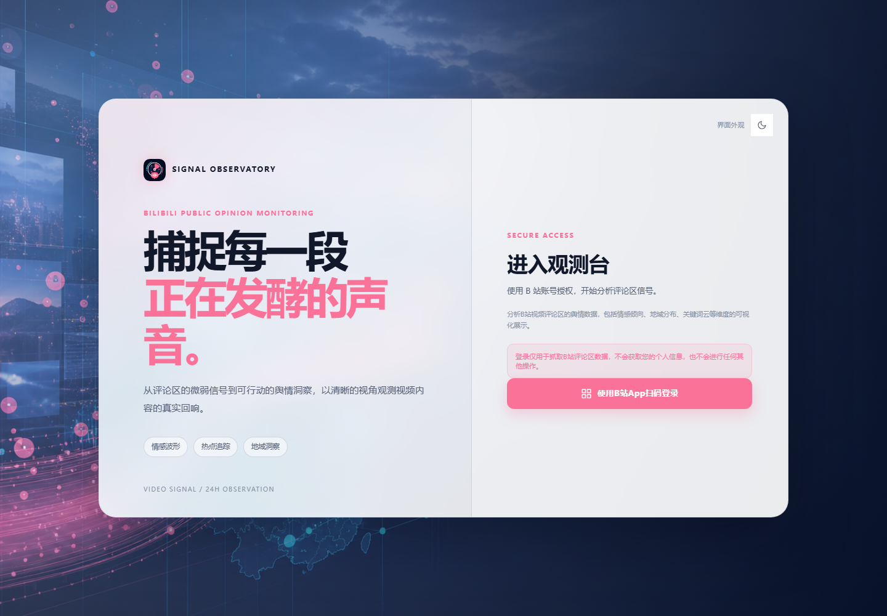
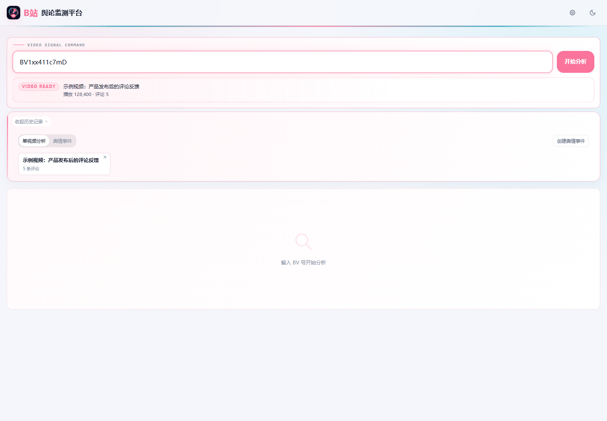
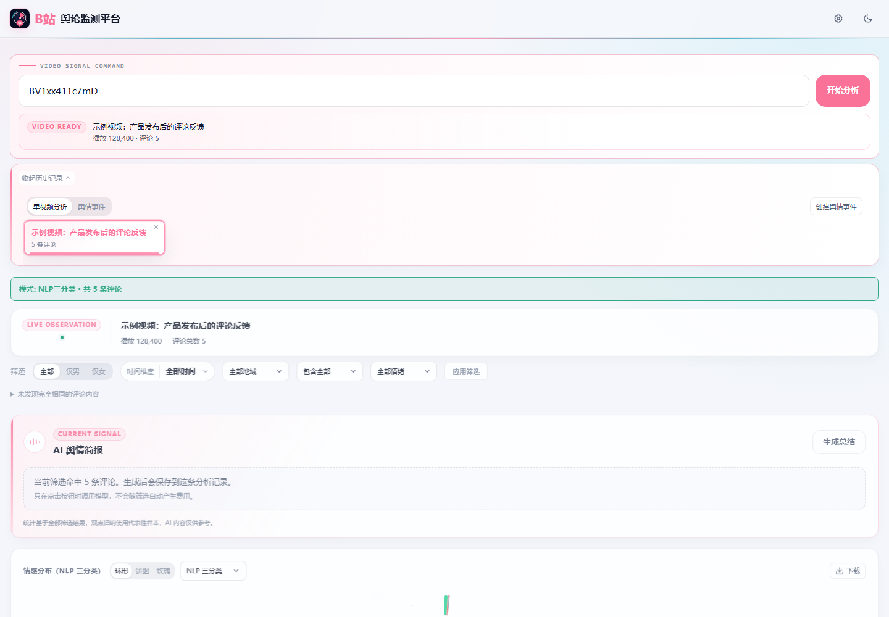
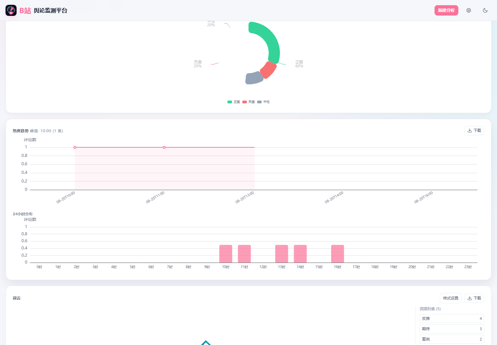
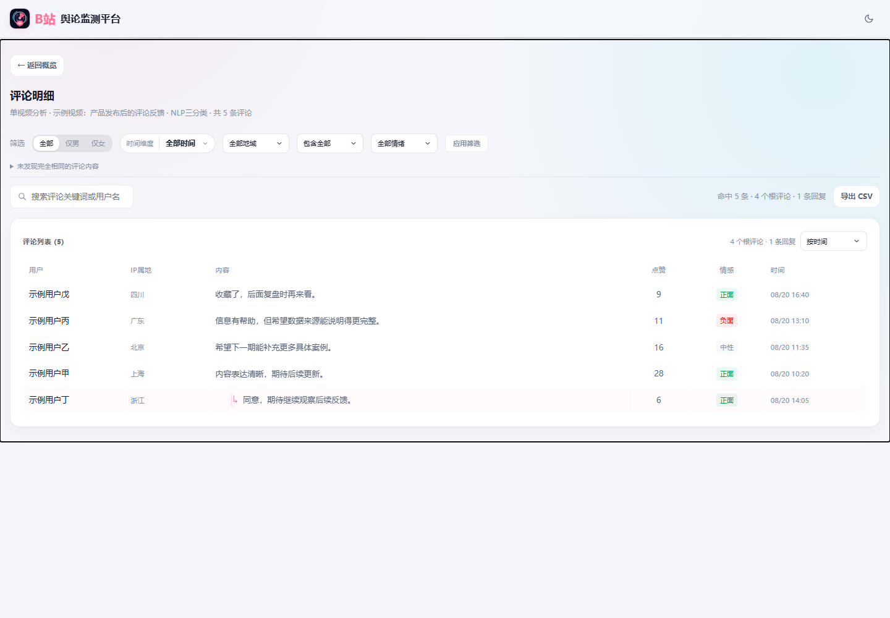
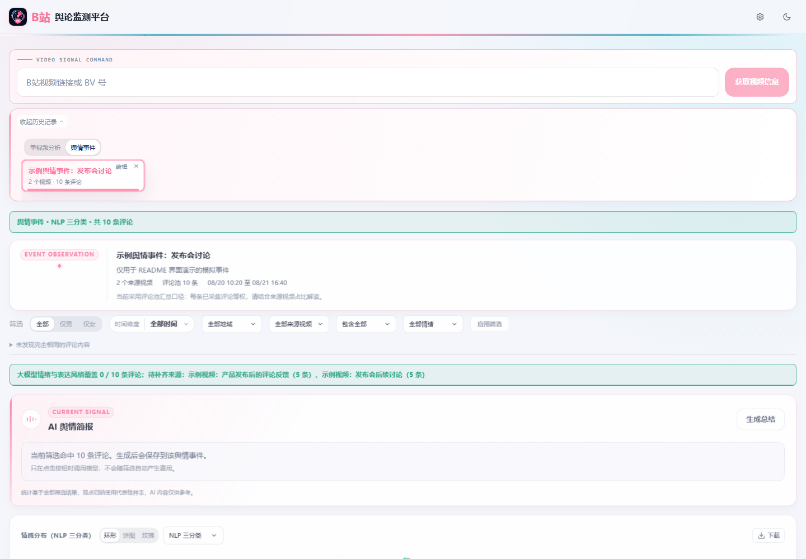
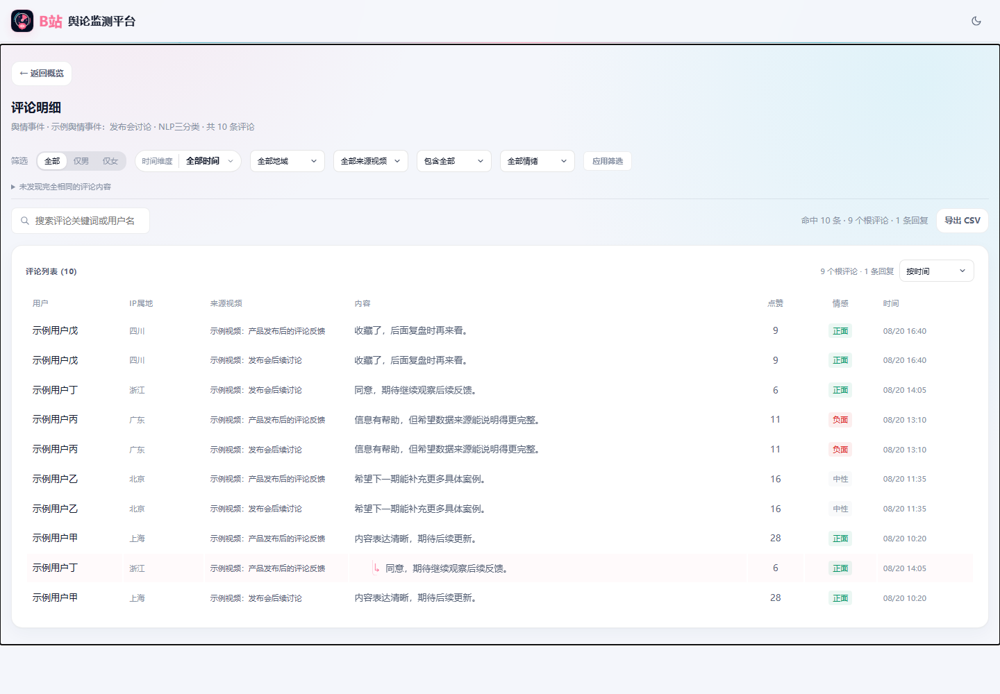
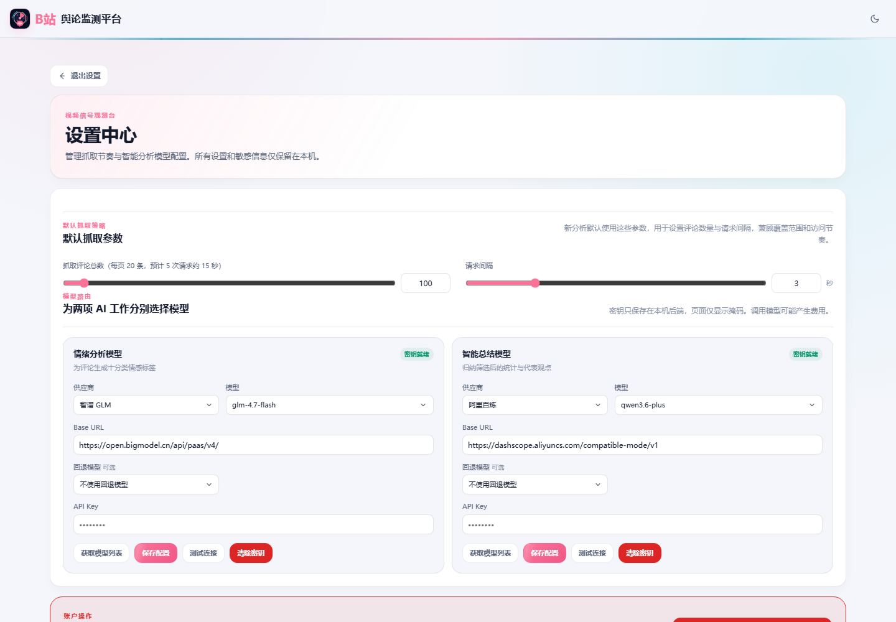

# B站舆论监测平台

<p align="center">
  
</p>

<p align="center">
  <strong>在自己的电脑上，看清 B 站视频评论区正在发生什么。</strong>
</p>

<p align="center">
  <a href="#下载与开始使用"></a>
  <a href="#数据与隐私"></a>
  <a href="#版本状态"></a>
  <a href="LICENSE"></a>
</p>

输入 B 站视频链接或 BV 号，完成扫码登录后即可在本机抓取评论，查看情感、地域、时间热度、关键词和词云等结果；也可主动抽样弹幕并查看本地情绪时间轴。需要更细致研判时，再由你主动启用大模型分析或 AI 简评。

> 本项目是本地优先的桌面工具：抓取、Cookie、分析记录和模型配置都留在你的电脑上。使用前请阅读[隐私政策](PRIVACY.md)。

```text
你的电脑 ──→ B 站（登录、视频与评论请求）
    └────→ 你配置的模型服务商（仅在你主动使用 AI 功能时）
    └────→ GitHub（下载或更新时）
```

## 界面预览

以下截图来自本地模拟数据；它们展示的是当前版本的完整用户路径。

### 1. 登录并确认视频

| 进入观测台 | 获取视频信息后开始分析 |
| --- | --- |
|  |  |

### 2. 单视频分析与评论证据

| 分析总览：统一筛选与 AI 简报 | 图表：情感、热度与词云 |
| --- | --- |
|  |  |

| 评论明细：筛选、搜索与导出 |
| --- |
|  |

### 3. 多视频舆情事件

| 事件总览：按评论池聚合来源视频 | 事件评论：可追溯到来源视频 |
| --- | --- |
|  |  |

### 4. 设置中心



实际结果会随视频、评论数量和你的筛选条件变化；重要判断请回到原始评论人工复核。

## 你可以做什么

- **分析一个视频**：先确认视频信息、评论数量和请求间隔，再抓取评论并生成可视化结果；部分完成的结果也可继续查看或重新采集。
- **观察弹幕时间轴**：主动选择分 P、抽样上限和请求间隔，在本机分析已抽样弹幕的正面、中性、负面分布；时间轴会标明未采样、失败和部分覆盖区间。
- **查看弹幕明细**：按播放时间分页查看已抽样弹幕、情感标签和请求片段。
- **看整体趋势**：在情感、性别、地域、时间热度、关键词和词云之间切换查看。
- **导出本机副本**：将当前筛选结果导出为 CSV，或将单张图表导出为 PNG；桌面版会让你选择保存位置，并显示保存结果。
- **统一筛选**：性别、时间、地域、情感与重复内容筛选会同步影响图表、评论列表、词云和后续手动生成的 AI 简报。
- **处理完全相同的评论**：可保留全部、每组保留一条，或排除整组。“重复内容”只描述文本是否完全相同，不代表账号或行为性质。
- **组合多个视频**：把 2 至 10 个已有分析创建为一个“舆情事件”，观察聚合结果与各视频来源占比。
- **按需使用大模型**：本地 NLP 会先给出正面、中性、负面趋势；更细的情绪、表达风格与 AI 简评仅在你主动操作后运行。AI 简评可选择舆情观察、公关与风险处置、视频创作者或新闻编辑视角，并提供快速或标准报告模式。
- **设置外观主题**：可在设置中心选择浅色、暗色或跟随系统，偏好会保存在本机。
- **回看本机历史**：分析记录保存在程序同级的 `data/` 目录，方便之后继续查看。

## 下载与开始使用

1. 前往 [GitHub Releases](https://github.com/gucheng-star/Bilibili-Public-Opinion-Monitoring-Platform/releases)，下载最新的 `BiliOpinionMonitor-<版本>-windows-x64.exe`。
2. 将 EXE 放到自己有写入权限的文件夹，例如 `F:\Apps\BiliOpinionMonitor`；不要直接放在系统受保护目录。
3. 双击启动。第一次启动时，程序会在 EXE 同级创建 `data/` 目录。
4. 在“进入观测台”页面点击“使用 B站App扫码登录”，用 B 站 App 完成授权。
5. 回到工作台，粘贴 B 站视频链接或输入 BV 号，先点击“获取视频信息”，确认评论数量和请求间隔后再开始分析。
6. 等待任务完成后，结合图表与原始评论进行判断；如需观察弹幕，可主动设置分 P、抽样上限和请求间隔后发起本地分析。如需大模型结果，请在设置中配置服务并主动发起 AI 简评。

程序是 Windows x64 单 EXE 便携版，无需另外安装 Python、Node.js 或 Rust。

> **请保护 `data/` 目录。** 删除它会永久删除本机数据库、登录信息、模型设置和分析记录；更新或移动程序前，请先备份整个目录。

## AI 智能体 — 一行接入

把这一行粘贴给你的本机 AI 编程 Agent：

```text
curl -fsSL https://raw.githubusercontent.com/gucheng-star/Bilibili-Public-Opinion-Monitoring-Platform/master/skills/bili-opinion/SKILL.md
```

就这一行。Agent 会先读取 Skill，并告诉你它准备执行的本机操作；只有在你明确授权后，它才会调用已安装的桌面程序创建一致的只读快照、注册或更新 `bili-opinion-readonly`，重新连接并验证 7 个只读工具。你不需要在设置页寻找或复制 JSON。

开始前，请从 [GitHub Releases](https://github.com/gucheng-star/Bilibili-Public-Opinion-Monitoring-Platform/releases) 下载 **0.3.0 或更高版本**，完成 B 站登录并至少进行一次本地分析。登录和分析仍由你主动完成，Agent 不会代替你操作。引导仅处理这一项本机 Codex MCP 配置：不会抓取 B站、上传 `data/`、读取 Cookie/API Key，或改动其他 MCP。新数据或应用升级后，只需再次明确授权 Agent 更新同名条目并重新连接。

## 数据与隐私

- B 站请求从你的电脑发出，使用当前网络出口 IP 和本机登录 Cookie；项目不提供中转服务器。
- SQLite 数据库、登录信息、模型配置、日志和分析记录保存在 EXE 同级 `data/` 目录。
- Windows 桌面版使用当前 Windows 用户的 DPAPI 加密 Cookie 和模型 API Key。
- DPAPI 不会加密评论与历史数据库本身；请勿把整个 `data/` 目录分享给不受信任的人。
- 默认本地 NLP（包括已抽样弹幕的时间轴分析）不调用付费模型，也不会在筛选、切换图表或重算词云时调用大模型。
- 只有你主动使用大模型功能时，必要的代表性评论文本才会发送到你自行配置的模型服务商；不会发送 Cookie、API Key、用户名或评论 ID。

完整的数据类型、处理目的、第三方服务、删除方式与使用者责任，请见[隐私政策（中文）](PRIVACY.md)。

## 使用前须知

- 评论与弹幕采集数量可能受 B 站分页、删除内容、分 P、账号权限、访问频率与风控策略影响，以本次实际成功保存或抽样的数量为准；弹幕时间轴只反映已抽样区间。
- 地域信息通常仅到省级；应用不会推测更精确的位置，也不会根据昵称、头像或评论推测年龄。
- 本地 NLP 和大模型结果用于辅助观察，不等同于人工标注或专业研究结论。涉及重要判断时，请回到原始评论人工复核。
- 将 `data/` 复制到另一台电脑后，历史数据库可以保留；但 Cookie 和模型 API Key 受 Windows 用户级加密保护，需要重新登录或重新录入。
- 预发布版本可能未进行商业代码签名，Windows SmartScreen 可能显示提示。请仅从本仓库 Releases 下载，并核对发布页的文件信息。

## 版本状态

当前版本为 **0.3.2**，仍处于预发布阶段。功能、数据结构和使用方式可能继续调整；更新前请备份 `data/` 目录。

## 系统要求

- Windows 10 1803（内部版本 17134）或更高版本，64 位。
- Microsoft Edge WebView2 Runtime（多数 Windows 10/11 设备已自带）。
- 能正常访问 B 站的网络环境。
- 程序所在目录具有写入权限。

## 合规说明

本项目与哔哩哔哩官方无隶属或授权关系。请遵守适用法律法规、B站服务条款与接口限制，合理设置抓取数量和请求间隔，并自行承担使用责任。

## 许可证与版权

Copyright © 2026 gucheng.

本项目采用 [MIT License](LICENSE)。许可证中文译文仅供参考，英文正文具有约束力。
