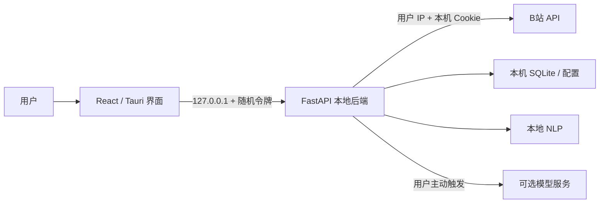

# B站舆论监测平台

本地优先的 B站视频评论区舆情分析工具。输入 BV 号或视频链接后，应用使用你的网络 IP 和登录 Cookie 抓取评论，并在本机完成存储、统计、可视化与可选的大模型分析。

> **当前版本：** `2.0.0-beta.1`，Windows x64 单 EXE 便携版。

## 项目特点

- **本地抓取**：B站请求由用户电脑直接发出，不通过项目服务器中转。
- **扫码登录**：后端在本机生成二维码 PNG，不依赖第三方二维码服务，不外传一次性授权地址。
- **单 EXE 便携版**：Tauri、React 前端、Python 后端和更新 runner 集成到一个 EXE，无需安装。
- **本地 NLP 优先**：新分析先运行正面、中性、负面三分类，不会自动产生大模型费用。
- **九类主情感**：用户主动切换后，可分析中性、喜悦、支持、期待、惊讶、愤怒、悲伤、担忧、厌恶。
- **表达方式识别**：玩梗和反讽作为独立标签，不与主情感混在一起。
- **精确重复内容监测**：按原始评论字符串逐字符识别完全相同的非空内容，支持保留、去重或排除重复组。
- **多维可视化**：情感、性别、地域、时间热度、关键词与词云。
- **统一筛选**：性别、时间、地域、情感和重复内容共同驱动图表、评论列表、关键词与词云，以及 AI 简报。
- **AI 舆情简报**：只在点击按钮时生成，使用精确统计和有限的代表性评论，并按筛选条件保存。
- **多供应商模型**：情感分析与智能总结分别配置百炼、DeepSeek 或自定义 OpenAI 兼容服务。
- **独立设置页面**：工作台与模型、抓取和更新设置通过应用内导航分开，切换页面不清空当前分析。
- **本地历史记录**：SQLite 保存分析结果，可回看和删除。
- **安全更新**：GitHub Release 更新验证大小、SHA-256 与 Ed25519 签名，失败自动回滚。

## 本地优先架构



Vercel 不参与应用运行。如果以后建立官网，Vercel 只负责项目展示、说明和下载引导。

## 普通用户：下载即用

1. 打开 [GitHub Releases](https://github.com/gucheng-star/Bilibili-Public-Opinion-Monitoring-Platform/releases)。
2. 下载 `BiliOpinionMonitor-<版本>-windows-x64.exe`。
3. 把 EXE 放在有写权限的位置，例如 `F:\Apps\BiliOpinionMonitor`。
4. 双击运行，无需安装 Python、Node.js 或 Rust。
5. 首次启动会在 EXE 同级创建 `data/`，然后打开应用窗口。

发布给其他用户时只需要发送 EXE。`data/` 是运行后生成的用户数据，不是程序依赖。

> **重要：** 删除 `data/` 会删除本机数据库、登录信息、模型设置与分析记录。移动到新电脑时可以携带 `data/`，但 Cookie 和 API Key 因 Windows DPAPI 绑定原用户，需要重新登录或输入。

### 系统要求

- Windows 10 1803（内部版本 17134）或更高版本，64 位。
- Microsoft Edge WebView2 Runtime。多数 Windows 10/11 已自带。
- 可访问 B站的网络。

测试版可能未进行商业代码签名，因此 Windows SmartScreen 可能显示警告。请只从本仓库 Releases 下载，并核对发布页 SHA-256。

## 登录与隐私

扫码登录流程如下：

1. 本机后端向 B站请求一次性登录地址。
2. 后端使用 `qrcode` 和 Pillow 在本机生成 PNG。
3. 前端直接显示 `data:image/png;base64,...`，不访问外部二维码图片站点。
4. 扫码状态通过 `POST /api/auth/qrcode/status` 的 JSON 请求体轮询，短期 key 不进入访问日志 URL。
5. 登录成功后，桌面版使用当前 Windows 用户的 DPAPI 加密凭据。

应用不会把 Cookie 发送到项目自建服务器。Cookie 仅用于从本机访问 B站接口。

## 分析流程

### 本地 NLP

首次分析固定使用 SnowNLP 三分类：

- 正面（`positive`）
- 中性（`neutral`）
- 负面（`negative`）

### 大模型情感分析

只有用户主动切换到大模型模式时才调用模型。主情感为九类：

`neutral`、`joy`、`support`、`anticipation`、`surprise`、`anger`、`sadness`、`concern`、`disgust`。

表达方式独立为 `plain`、`meme`、`sarcasm`。为了理解回复语境，每条评论最多携带根评论和直接父评论；上下文只帮助理解指代、玩梗与反讽，不会把父评论情绪转移到当前评论。

每批处理 5 条评论，最多并发 3 批，失败批次最多重试 2 次。服务端根据评论 ID、标签集合和返回数量校验结果；DeepSeek 与阿里百炼的结构化调用会启用 JSON Output。重分析时，情感分布卡片会按后端实际完成的评论数量显示进度；失败仍保留原 NLP 结果。

### 精确重复评论监测

系统仅按原始评论字符串逐字符比较，将完全相同的非空文本归为一组，不做近似匹配、语义判断或跨分析合并。默认“包含全部”，还可选择“每组保留一条”或“排除整组”。

“重复内容”是客观的数据清洗标记，不等于水军、机器人、异常账号或恶意行为。切换重复内容筛选后，图表、评论列表、关键词/词云和随后手动生成的 AI 简报都复用同一最终筛选集合；筛选本身只在本机重算数据，不会自动调用付费大模型。

`GET /api/results/{analysis_id}` 的每条评论会返回 `is_exact_duplicate`、`duplicate_group_size`、`duplicate_group_key` 和 `is_duplicate_canonical` 派生字段，并在 `duplicate_statistics` 中返回重复组数、涉及评论数、冗余条数与涉及占比。`POST /api/keywords/{analysis_id}` 接收当前 `filters`，从同一最终筛选集合重算 `matched_count` 和关键词列表，不调用任何大模型。

### AI 舆情简报

- 只在点击“生成总结”或“重新生成”时调用模型。
- 后端根据当前筛选重新计算精确统计，不信任前端提交的统计结果。
- 最多发送 40 条、合计不超过 12,000 字的代表性评论。
- 不发送用户名、评论 ID、Cookie 或 API Key。
- 筛选变化不会自动调用模型或产生费用。

## 开发环境

### 要求

| 工具 | 版本 |
| --- | --- |
| Python | 3.12 |
| Node.js | 22 或更高 |
| pnpm | 11 |
| Rust | 1.77 或更高，仅桌面构建需要 |
| Windows | Windows 10/11 x64，桌面构建需要 |

### 安装依赖

```powershell
cd backend
python -m venv venv
.\venv\Scripts\python.exe -m pip install -r requirements-portable.txt

cd ..\frontend
pnpm install
```

### 启动网页开发环境

终端 1：

```powershell
cd backend
.\venv\Scripts\python.exe -m uvicorn main:app --host 127.0.0.1 --port 8000 --reload
```

终端 2：

```powershell
cd frontend
pnpm run dev
```

浏览器打开 `http://localhost:5173`。应用使用 Hash 路由，设置页面地址为 `http://localhost:5173/#/settings`，同一套地址结构兼容 Tauri WebView。

> **验证点：** 登录页应能生成清晰二维码；浏览器网络记录中不应出现 `api.qrserver.com`，二维码状态请求不应把 `qrcode_key` 放在 URL 查询参数中。

### 运行测试

```powershell
cd backend
.\venv\Scripts\python.exe -m unittest discover -s tests -v

cd ..\frontend
pnpm run lint
pnpm run build

cd ..
cargo fmt --manifest-path frontend\src-tauri\Cargo.toml -- --check
cargo test --manifest-path frontend\src-tauri\Cargo.toml --bins
```

## 构建 Windows 单 EXE

```powershell
cd frontend
pnpm run tauri:build

cd ..
.\scripts\assemble-portable.ps1 -Version 2.0.0-beta.1
```

输出位置：

```text
dist/portable/BiliOpinionMonitor-2.0.0-beta.1-windows-x64.exe
```

`tauri:build` 会强制执行以下流程：

1. 删除旧 Python 后端产物。
2. 使用固定依赖重新构建 PyInstaller onefile 后端。
3. 校验后端产物与 Tauri 嵌入资源 SHA-256 一致。
4. 构建 React 前端和 Tauri release 主程序。
5. 由组装脚本校验 Cargo、Tauri 与发布版本一致后输出版本化 EXE。

不要直接复用旧的 `frontend/src-tauri/resources/BiliOpinionBackend.exe`，否则可能把旧功能嵌入新桌面程序。

## GitHub 上传与发布前必读

### 不得上传的内容

以下内容已在 `.gitignore` 中排除，提交前仍应使用 `git status` 复核：

- `backend/auth.json`、`backend/settings.json`、`.env`
- SQLite 数据库、`*.db-wal`、`*.db-shm`
- `backend/venv/`、`frontend/node_modules/`
- `backend/dist/`、`frontend/dist/`、`frontend/src-tauri/target/`、`dist/`
- 本机 `.agents/`、`.codex/`、`.claude/` 与 `PROJECT.md`
- 日志文件与本地缓存

### 发布版本必须一致

发布前同时更新：

- `frontend/src-tauri/Cargo.toml` 中的 `version`
- `frontend/src-tauri/tauri.conf.json` 中的 `version`
- Git 标签，例如 `v2.0.0-beta.1`

组装脚本会拒绝版本不一致的构建。版本不一致还会导致更新健康检查失败并回滚。

### 发布门禁

1. 运行后端、前端和 Rust 全量测试。
2. 在网页开发环境验证登录、筛选与图表。
3. 重建最终单 EXE，并在真实 WebView 中再次验证二维码。
4. 检查 EXE 为 Windows GUI 子系统，不会弹出命令行。
5. 确认 GitHub Actions 已配置更新签名私钥，仓库只包含公钥。
6. 先检查待推送提交和目标分支；未经项目所有者明确确认，不推送 `master`、标签或 Release。

GitHub 工作流只由 `v*` 标签触发，发布资产为版本化 EXE 和 `latest-portable.json`。

## 项目文档

| 文件 | 内容 |
| --- | --- |
| [PORTABLE-README.txt](PORTABLE-README.txt) | 便携版用户使用、数据与更新说明 |
| [docs/DESKTOP_ARCHITECTURE.md](docs/DESKTOP_ARCHITECTURE.md) | Tauri、后端、数据目录和更新安全协议 |
| [frontend/README.md](frontend/README.md) | 前端开发与桌面运行契约 |
| [backend/tests/sentiment-fixture-test-cases.md](backend/tests/sentiment-fixture-test-cases.md) | 九类情感与表达方式测试用例 |
| [LICENSE](LICENSE) | MIT 许可证及中文参考译文 |

`PROJECT.md` 与 `.agents/AGENTS.md` 是本机维护资料，默认不上传 GitHub。

## 常见问题

### 二维码显示为空白或破图

更新到使用本地 PNG 二维码的版本。不要恢复第三方二维码图片 URL；Tauri CSP 只允许本地、asset、data 和 blob 图片。

### 出现 `attempt to write a readonly database`

这是 SQLite 文件或目录写权限问题，不是 B站或模型 API Key 问题。检查后端目录或桌面 EXE 同级 `data/` 是否可写。

### 桌面接口出现 `/auth/*` 404

检查桌面运行配置中的 `apiBase` 是否已经包含 `/api` 前缀。前端组件应统一通过 `src/services/api.ts` 请求。

### 移动 EXE 后需要重新登录

同一 Windows 用户移动位置通常不影响 DPAPI。复制到其他电脑或其他 Windows 用户后，Cookie 与模型密钥无法解密，需要重新登录和输入；历史 SQLite 数据仍可保留。

## 合规说明

本项目与哔哩哔哩官方无隶属或授权关系。使用者应遵守适用法律法规、B站服务条款和接口限制，合理设置抓取数量与请求间隔，并自行承担使用责任。

## 许可证与版权

Copyright © 2026 gucheng.

本项目采用 MIT License，详见 [LICENSE](LICENSE)。中文译文仅供参考，许可证英文正文具有约束力。
